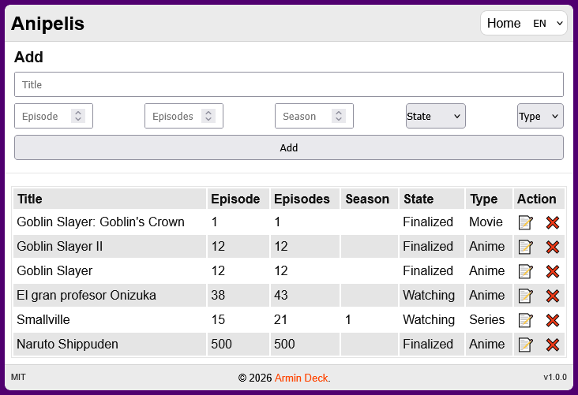

# anipelis
Aplicación web PHP ligera para administración y visualización de una colección de películas. Incluye funcionalidades CRUD básicas, configuración por archivos JSON y una sencilla interfaz de usuario.

## 🚀 Características principales  
- Agregar anime, pelicula, ova, etc
- Modificar anime, pelicula, ova, etc
- Eliminar anime, pelicula, ova, etc
- Cambio de idioma (español, ingles)

## 🌐 Información adicional  
🔗 Página oficial: [dbproject.rf.gd](https://dbproject.rf.gd)  
